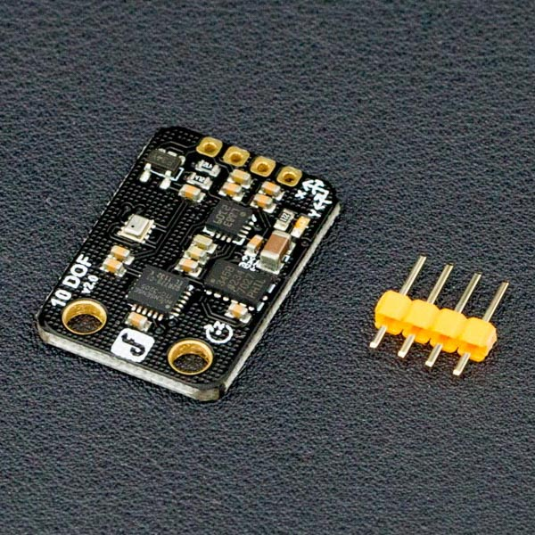

# DFRobot_QMC5883
- [English Version](./README.md)

DFrobot的高集成度低成本的10自由度传感器,集合了ADXL345加速度计、QMC5883L磁罗盘、ITG3205陀螺仪以及BMP280气压传感器和温度传感器。内置了低噪声的低压线性稳压器，还扩展了电源电压输入范围，支持3V-5V电源电压。同时，10自由度IMU也可以直接和Arduino控制板兼容。



## 产品链接 (https://www.dfrobot.com.cn/goods-640.html)

    SKU: SEN0140

## 目录

* [概述](#概述)
* [库安装](#库安装)
* [方法](#方法)
* [兼容性](#兼容性y)
* [历史](#历史)
* [创作者](#创作者)

## 概述

这个库提供了QMC5883，HMC5883 和 VMC5883的驱动程序

## 库安装

使用此库前，请首先下载库文件，将其粘贴到\Arduino\libraries目录中，然后打开examples文件夹并在该文件夹中运行演示。

## 方法

```C++

    /**
     * @fn begin
     * @brief 传感器初始化
     * @return bool 初始化状态
     * @retval true 初始化成功
     * @retval false 初始化失败
     */
    bool begin(void);

    /**
     * @fn readRaw
     * @brief 获取传感器采集的数据
     * @return sVector_t 电子罗盘采集数据信息
     */
    sVector_t readRaw(void);

    /**
     * @fn setRange
     * @brief 设置传感器信号增益范围
     * @param range 
     * @n    HMC5883L_RANGE_8_1GA    
     * @n    HMC5883L_RANGE_5_6GA    
     * @n    HMC5883L_RANGE_4_7GA    
     * @n    HMC5883L_RANGE_4GA      
     * @n    HMC5883L_RANGE_2_5GA    
     * @n    HMC5883L_RANGE_1_9GA    
     * @n    HMC5883L_RANGE_1_3GA //default    
     * @n    HMC5883L_RANGE_0_88GA   
     * @n    QMC5883_RANGE_2GA     
     * @n    QMC5883_RANGE_8GA     
     * @n    VCM5883L_RANGE_8GA    
     */
    void  setRange(eRange_t range);

    /**
     * @fn getRange
     * @brief 获取传感器信号增益范围
     * @return eRange_t
     */
    eRange_t getRange(void);

    /**
     * @fn setMeasurementMode
     * @brief 设置测量模式
     * @param mode
     * @n     HMC5883L_IDLE
     * @n     HMC5883_SINGLE
     * @n     HMC5883L_CONTINOUS
     * @n     QMC5883_SINGLE
     * @n     QMC5883_CONTINOUS
     * @n     VCM5883L_SINGLE
     * @n     VCM5883L_CONTINOUS
     */
    void setMeasurementMode(eMode_t mode);

    /**
     * @fn  getMeasurementMode
     * @brief 获取测量模式
     * @return eMode_t
     */
    eMode_t getMeasurementMode(void);

    /**
     * @fn setDataRate
     * @brief 设置传感器采集数据的频率
     * @param dataRate
     * @n     HMC5883L_DATARATE_75HZ
     * @n     HMC5883L_DATARATE_30HZ
     * @n     HMC5883L_DATARATE_15HZ
     * @n     HMC5883L_DATARATE_7_5HZ
     * @n     HMC5883L_DATARATE_3HZ
     * @n     HMC5883L_DATARATE_1_5HZ
     * @n     HMC5883L_DATARATE_0_75_HZ
     * @n     QMC5883_DATARATE_10HZ
     * @n     QMC5883_DATARATE_50HZ
     * @n     QMC5883_DATARATE_100HZ
     * @n     QMC5883_DATARATE_200HZ
     * @n     VCM5883L_DATARATE_200HZ
     * @n     VCM5883L_DATARATE_100HZ
     * @n     VCM5883L_DATARATE_50HZ
     * @n     VCM5883L_DATARATE_10HZ
     */
    void  setDataRate(eDataRate_t dataRate);

    /**
     * @fn getDataRate
     * @brief 获取传感器采集数据的频率
     * @return eDataRate_t
     */
    eDataRate_t getDataRate(void);

    /**
     * @fn setSamples
     * @brief 设置传感器状态
     * @param samples
     * @n     HMC5883L_SAMPLES_8
     * @n     HMC5883L_SAMPLES_4
     * @n     HMC5883L_SAMPLES_2
     * @n     HMC5883L_SAMPLES_1
     * @n     QMC5883_SAMPLES_8
     * @n     QMC5883_SAMPLES_4
     * @n     QMC5883_SAMPLES_2
     * @n     QMC5883_SAMPLES_1
     */
    void  setSamples(eSamples_t samples);

    /**
     * @fn getSamples
     * @brief 获取传感器状态
     * @return eSamples_t
     */
    eSamples_t getSamples(void);

    /**
     * @fn  setDeclinationAngle
     * @brief 设置传感器偏转角
     * @param declinationAngle
     */
    void setDeclinationAngle(float declinationAngle);

    /**
     * @fn getHeadingDegrees
     * @brief 设置传感器量程
     */
    void getHeadingDegrees(void);

    /**
     * @fn getICType
     * @brief 获取传感器型号
     * @return int
     */
    int getICType(void);

    /**
     * @fn  isHMC
     * @brief 判断传感器型号是否是HMC5883
     * @return bool 
     * @retval ture 是
     * @retval false 不是
     */
    bool isHMC(void){if(ICType == IC_HMC5883L ){return true;}return false;}

    /**
     * @fn  isQMC
     * @brief 判断传感器型号是否是QMC5883
     * @return bool
     * @retval ture 是
     * @retval false 不是
     */
    bool isQMC(void){if(ICType == IC_QMC5883 ){return true;}return false;}

    /**
     * @fn  isVCM
     * @brief 判断传感器型号是否是VMC5883
     * @return bool
     * @retval ture 是
     * @retval false 不是
     */
    bool isVCM(void){if(ICType == IC_VCM5883L ){return true;}return false;}
```

## 兼容性

主板               | 通过  | 未通过   | 未测试   | 备注
------------------ | :----------: | :----------: | :---------: | -----
Arduino uno        |      √       |              |             | 
Mega2560        |      √       |              |             | 
Leonardo        |      √       |              |             | 
ESP32           |      √       |              |             | 
ESP8266           |      √       |              |             | 
micro:bit        |      √       |              |             | 


## 历史

- 2022/2/23 - 1.0.0 版本

## 创作者

Written by PengKaixing(kaixing.peng@dfrobot.com), 2019. (Welcome to our [website](https://www.dfrobot.com/))